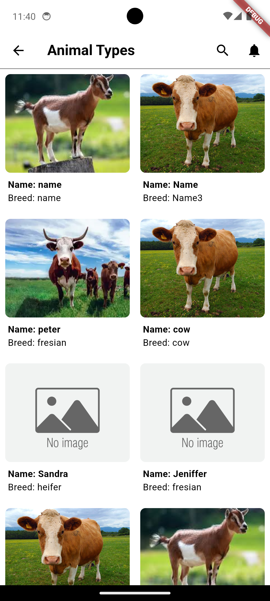
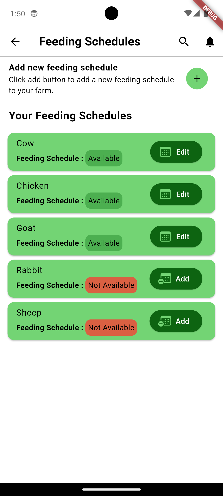

# Farm Up Application

This is an application made for farmers to help them manage their livestock using various features such as scheduling feeds, vaccinations and also capturing quantity of produce. 

It enables farmers focus on more important farm activities as it is cumbersome to remember all activities without a proper management system.

The app utilizes Gemini API in the chat section to help farmers seek solutions to questions they may have.


## Installation

### Prerequisites

- IDE of choice, preferably [VSCode](https://code.visualstudio.com/download).
- [Firebase](https://firebase.google.com/) for the backend services.
- [Flutter](https://docs.flutter.dev/get-started/install) Framework.
- Gemini API using google's [Vertex AI](https://firebase.google.com/docs/vertex-ai/get-started)
- [BloC](https://bloclibrary.dev/getting-started/) state management Library.


### How to Install
Download flutter from the above link and follow installation steps. Configure your own firebase app and integrate Vertex AI to the project based on the platform.


```bash
  git clone https://github.com/CharlesAbuga/farm_up.git
```
After cloning the project cd into it and run it.
```bash
    cd farm_up
    flutter run

```
    
## Key Features
- Vaccination Schedule for reminding users on the right date to vaccinate animals.
- Intuitive animations that not only alert users on some actions but also makes usage smooth.
- Intuitive navigation system to easily go to relevant pages easily.

## Example codes

### Vertex API Sample Code
Here is the code snippet for the vertex API integration that is in the [gemini_chat_bloc](lib/bloc/gemini_chat/gemini_chat_bloc.dart)

```
  final model = FirebaseVertexAI.instance.generativeModel(
    model: 'gemini-1.5-flash',
    systemInstruction: Content.system(
        "You are a farm helper bot.Your goal is to help farmers with their queries limiting them to only livestock related queries."),
  );
```

## Screenshots
Below are the screenshots of the applications highlighting the main pages including the Gemini Chat page.


### HomePage


### My Animals


### Animal Types


### Feeding Schedule


### Chat Page 1


### Chat Page 2


## Features to be Implemented soon...
You are very much welcome in implementing the following features 🛠️🛠️

- A complete notification system using Flutter Notifications integrated with firebaseto notify farmers on various feeding times.
- A complete settings page with various theme color options to choose from.
- A text messaging page where farmers can chat with vetrinary officers and get professional feedback on their queries.

## License

```

MIT License (MIT)

Copyright (c) 2024 Charles Abuga.

Permission is hereby granted, free of charge, to any person obtaining a copy
of this software and associated documentation files (the "Software"), to deal
in the Software without restriction, including without limitation the rights
to use, copy, modify, merge, publish, distribute, sublicense, and/or sell
copies of the Software, and to permit persons to whom the Software is
furnished to do so, subject to the following conditions:

The above copyright notice and this permission notice shall be included in all
copies or substantial portions of the Software.

THE SOFTWARE IS PROVIDED "AS IS", WITHOUT WARRANTY OF ANY KIND, EXPRESS OR
IMPLIED, INCLUDING BUT NOT LIMITED TO THE WARRANTIES OF MERCHANTABILITY,
FITNESS FOR A PARTICULAR PURPOSE AND NONINFRINGEMENT. IN NO EVENT SHALL THE
AUTHORS OR COPYRIGHT HOLDERS BE LIABLE FOR ANY CLAIM, DAMAGES OR OTHER
LIABILITY, WHETHER IN AN ACTION OF CONTRACT, TORT OR OTHERWISE, ARISING FROM,
OUT OF OR IN CONNECTION WITH THE SOFTWARE OR THE USE OR OTHER DEALINGS IN THE
SOFTWARE.
```

